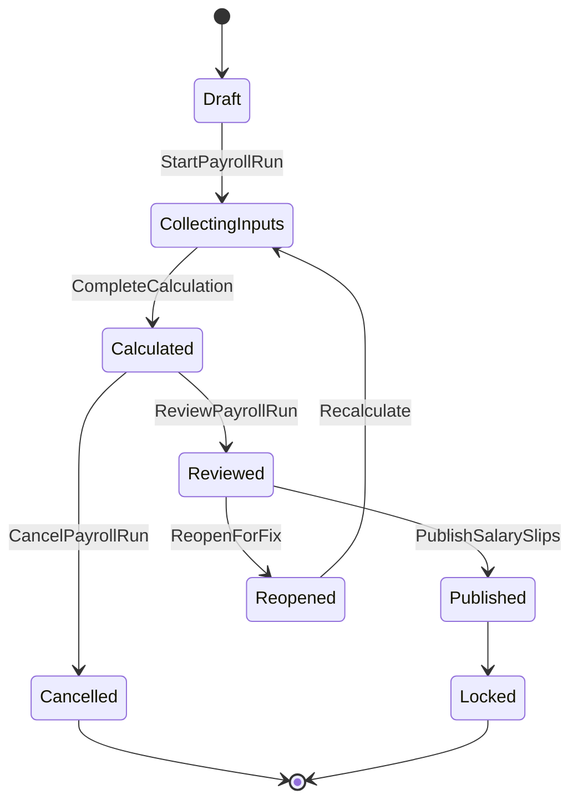

# Payroll Domain

## 責任範圍
- 計薪期間、輸入收斂、計算、發佈薪資結果。
- 管理 payroll snapshot 與 salary slip 生命周期。

## 不負責的事項
- 員工角色真相。
- 原始打卡與請假審批。
- 前端匯出 UI 流程。

## Aggregate / Entity / Value Object 候選
| 類型 | 候選 |
| --- | --- |
| Aggregate | `PayrollPeriod`, `SalarySlip` |
| Entity | `PayrollLine`, `DeductionItem`, `PayrollInputSnapshot` |
| Value Object | `PayrollStatus`, `Money`, `PayrollWindow`, `InputVersion` |

## 主要狀態機

## Domain Event 候選
- `PayrollRunStarted`
- `PayrollInputsCollected`
- `PayrollCalculated`
- `PayrollReviewed`
- `PayrollPublished`
- `SalarySlipGenerated`

## 與其他 Context 的協作
| 對象 | 協作方式 |
| --- | --- |
| `Employee` | 取得 payroll snapshot、在職狀態 |
| `Attendance` | 讀 finalized attendance summary |
| `Leave` | 讀 approved leave adjustment |
| `Overtime` | 讀 approved overtime adjustment |
| `Audit / Security` | 記錄 run、覆核、發佈、匯出 |
