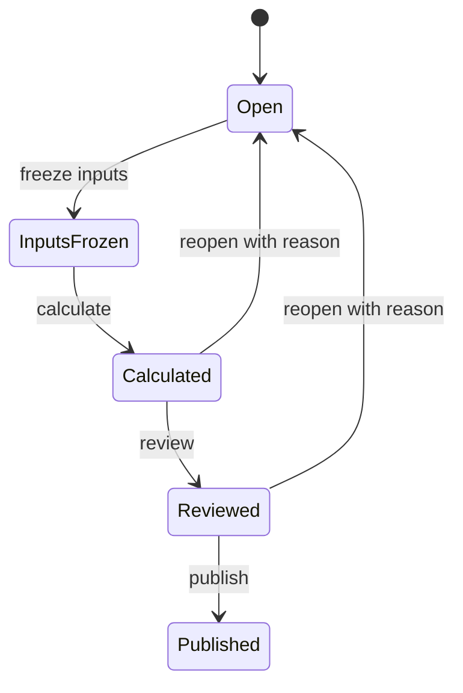

# Payroll Domain

## 邊界
| 負責 | 不負責 |
| --- | --- |
| PayrollPeriod、PayrollInput、PayrollResult、PayrollAdjustment、薪資單與匯出 | 上游原始資料、銀行實際撥薪、報稅、保險申報、會計總帳 |

## 模型
| 類型 | 模型 |
| --- | --- |
| Aggregates | `PayrollPeriod`, `PayrollResult` |
| Entity / VO | `PayrollInput`, `PayrollAdjustment`, `PayrollLine`, `Money`, `PayrollInputVersion` |
| Domain Event | `PayrollPeriodOpened`, `PayrollInputsFrozen`, `PayrollCalculated`, `PayrollAdjusted`, `PayrollReviewed`, `PayrollResultsPublished` |
| Public contract | `PayrollResultSummary`, `SalarySlipView` |
| Ports | `PayrollPeriodRepository`, `PayrollResultRepository`, `PayrollResultQueryPort` |

## 狀態

## 輸入收斂
- 每個 PayrollInput 保存 Employee／Organization／Attendance／Leave／Overtime Published Language 的 ID 與 version。
- 凍結後不得靜默更換上游版本；重新收斂必須 reopen、audit 並產生新 input version。
- PayrollResult 只引用 frozen input，不取得或改寫上游 Aggregate。
- Payroll rule 由 Payroll 擁有並版本化；法域數值在確認前保持待設定，不硬編碼。
