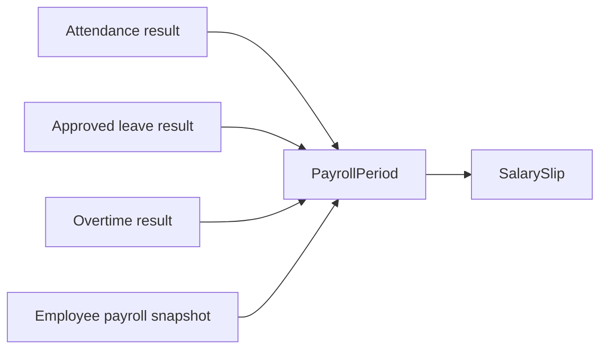

# Payroll Domain

## 目的
- 定義計薪期間、輸入收斂與薪資結果的邊界。

## 圖解

## 規則
- Payroll 只消費公開契約，不直接回寫 Attendance、Leave、Overtime 或 Employee 來源資料。
- `PayrollPeriod` 關帳後不得任意覆寫結果。
- 薪資、扣款、帳戶與發薪結果屬敏感資料，只能由 server-side 控制更新。

## 範例
- 缺少必要輸入 snapshot 或輸入版本不一致時，應阻止結算而不是以預設值硬算。

## 維護注意事項
- 幣別、四捨五入與發佈策略屬高風險規則，補實作前先更新需求與 security 文件。
