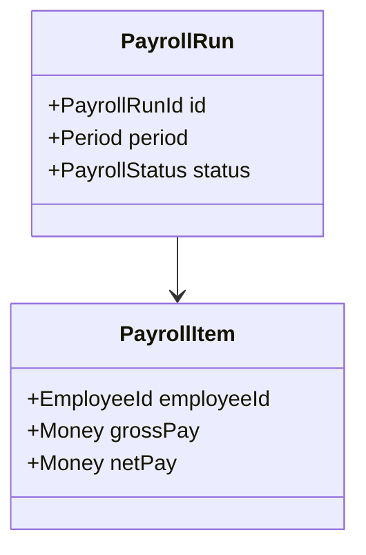

# Payroll Domain

## 目的
- 定義薪資結算批次與明細。

## 圖解

```mermaid
classDiagram
  class PayrollRun {
    +PayrollRunId id
    +Period period
    +PayrollStatus status
  }
  class PayrollItem {
    +EmployeeId employeeId
    +Money grossPay
    +Money netPay
  }
  PayrollRun --> PayrollItem
```

## 規則
- Payroll 只能依賴已核准資料進行結算。
- 薪資資料屬敏感資料，更新必須走 server-side。

## 範例
- 關帳後的 payroll run 不可任意覆寫。

## 維護注意事項
- 薪資公式細節應留在專用文件或後續 ADR。
