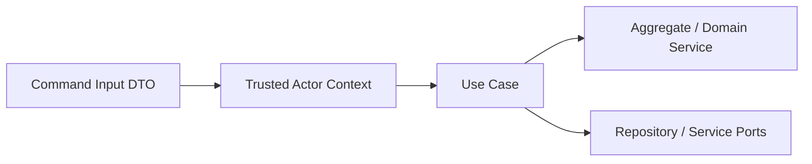

# Commands

## 目的
- 定義會改變狀態的 application command 命名規範與輸入責任。

## 命名規範
| 規則 | 說明 |
| --- | --- |
| 動詞開頭 | `SubmitLeaveRequest`, `ApproveLeaveRequest`, `StartPayrollRun` |
| 表達業務意圖 | 不用 `HandleLeaveForm`、`UpdateFirestoreDoc` 這類技術名 |
| 一個 command 一個核心意圖 | 不把查詢、匯出、批次修補混在一起 |
| 敏感操作明確命名 | `PublishSalarySlips`, `GrantCapability`, `ExportAuditLogs` |

## Command 結構

## Command 分類
| 類型 | 範例 | 注意事項 |
| --- | --- | --- |
| Self-service | `RecordPunch`, `SubmitLeaveRequest` | actor scope 多為 self |
| Approval | `ApproveLeaveRequest`, `ApproveOvertimeRequest`, `RecordApprovalDecision` | 必驗證 `ApprovalAssignmentResult` 與 approver capability |
| HR / Payroll | `StartPayrollRun`, `CalculatePayroll`, `PublishSalarySlips` | 敏感寫入，server-only |
| Sensitive | `GrantCapability`, `ExportAuditRecords` | 必有 audit 與最小權限；分別屬 Employee、Audit |
| Integration | `GrantCompensatoryLeave` | 依 `eventId` 冪等，不信任外部 document shape |

## Command handler 規則
- 只做 orchestration，不放 Firebase SDK 與 UI state。
- 需要跨 Context 時，使用 query port 或公開契約。
- command result 應回傳穩定 application output，不直接回 Firestore document。
- Security 是 command guard，不是 command 所屬 Context；`GrantCapability` 屬 Employee，`ExportAuditRecords` 屬 Audit。
