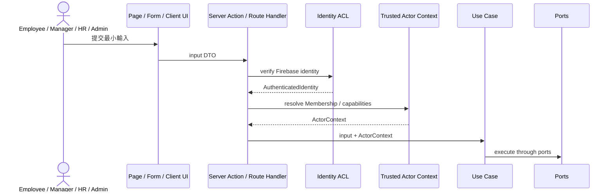

# Use Cases

## 目的
- 定義全部 Context 的首批 application use case、trusted actor、輸入輸出與必要 ports。
- 細部 HR 政策可延後，但 use case 邊界、資料所有權與跨 Context 契約不得留給實作者猜測。

## Trusted Actor Flow

## 輸入輸出規則
| 主題 | 規則 |
| --- | --- |
| Input | 只含 primitive、ID、period、reason、flags；不含 Firebase SDK 型別 |
| Output | 回傳 Published Language、result、error code、next step；不回傳 Aggregate |
| Actor | 必帶 `actorId`、`membershipId`、`capabilities`、`scope`、`requestSource` |
| Error | Domain / application error code 由 adapter 映射為 UI 或 HTTP response |
| Idempotency | integration event 與敏感重試 command 必須攜帶穩定 request／event ID |
| Audit | mutation 透過 local outbox 原子記錄；敏感讀取、拒絕與匯出透過同步 `AuditPort` 記錄 |

## 全 Context 首批 Use Cases
| Context | Use case | 主要輸入 | 主要輸出 | 主要 ports |
| --- | --- | --- | --- | --- |
| Employee | `HireEmployee`, `UpdateEmployeeProfile`, `SuspendMembership`, `ReinstateMembership`, `TerminateEmployment`, `GrantCapability`, `RevokeCapability` | employee／membership IDs、profile、capability、reason | employee／membership status、version | `EmployeeRepository`, `MembershipRepository`, `AuditPort` |
| Attendance | `RecordPunch`, `RequestAttendanceCorrection`, `ApplyAttendanceCorrection`, `FinalizeAttendanceRecord` | employee、timestamp、action／correction | record ID、status、`FinalizedAttendanceSummary?` | `AttendanceRecordRepository`, `EmployeeProfileQueryPort`, `ClockPort`, `AuditPort` |
| Leave | `SubmitLeaveRequest`, `ApproveLeaveRequest`, `RejectLeaveRequest`, `CancelLeaveRequest`, `GrantCompensatoryLeave` | employee、type、period、decision／event | request ID、status、`ApprovedLeaveSummary?` | `LeaveRequestRepository`, `LeaveBalanceLedgerRepository`, `EmployeeProfileQueryPort`, `ApprovalAssignmentQueryPort`, `AuditPort` |
| Approval | `ResolveApprovalAssignment`, `ApplyDelegation`, `EscalateApproval`, `RecordApprovalDecision` | target ref、actor、delegate window、decision ref | `ApprovalAssignmentResult` | `ApprovalAssignmentRepository`, `EmployeeProfileQueryPort`, `ClockPort`, `AuditPort` |
| Overtime | `SubmitOvertimeRequest`, `ApproveOvertimeRequest`, `RejectOvertimeRequest`, `CancelOvertimeRequest`, `PublishOvertimeCompensation` | employee、period、mode、decision | request ID、status、`OvertimeAdjustment?`／event | `OvertimeRequestRepository`, `AttendanceSummaryQueryPort`, `ApprovalAssignmentQueryPort`, `IntegrationEventPort`, `AuditPort` |
| Payroll | `StartPayrollRun`, `CollectPayrollInputs`, `CalculatePayroll`, `ReviewPayroll`, `ReopenPayroll`, `PublishSalarySlips`, `CancelPayrollRun` | window、`PayrollInputVersion`、decision | payroll period ID、status、summary | `PayrollPeriodRepository`, `SalarySlipRepository`, upstream query ports, `ClockPort`, `AuditPort` |
| Audit | `AppendAuditRecord`, `SearchAuditRecords`, `ExportAuditRecords` | audit facts／scope／filters | audit ID／masked results／export ref | `AuditStorePort`, `TrustedActorContextPort`, `ExportPort`, `ClockPort` |

## 失敗契約
| Error code | 使用時機 | Adapter 行為 |
| --- | --- | --- |
| `UNAUTHENTICATED` | 無有效 identity | 回 401／導向登入，不呼叫 use case |
| `FORBIDDEN` | capability 或 scope 不符 | 回 403 並 append denied audit |
| `NOT_FOUND` | aggregate 或必要 snapshot 不存在 | 回 404；不可洩漏其他 scope 資料 |
| `CONFLICT` | 非法狀態轉移、重複打卡、版本衝突 | 回 409；保留現有狀態 |
| `UPSTREAM_UNAVAILABLE` | 必要同步 query port timeout／失敗 | 回可重試錯誤；不得用陳舊資料靜默繼續 |
| `VALIDATION_FAILED` | 期間、欄位或 command 不合法 | 回 400 與穩定 field errors |
| `AUDIT_RECORDING_FAILED` | mutation 無法寫入 local outbox，或敏感 read／denied 無法同步 append | command／query 整體失敗；不得提交未留痕的敏感異動 |

## Adapter 規則
- Server Action 適合表單 mutation；Route Handler 適合 API、webhook 與非畫面整合。
- Adapter 必須建立 `AuthenticatedIdentity` 與 `ActorContext` 後才呼叫 use case。
- Client Component 不可 new repository、import Firebase adapter 或提交 role／capability。
- `GrantCompensatoryLeave` 是 integration event consumer，依 `eventId` 冪等。
