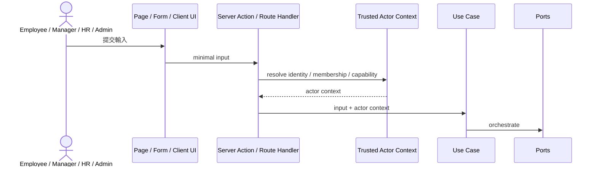

# Use Cases

## 目的
- 定義主要 use case、輸入輸出格式、trusted actor context 與對應 ports。

## Trusted Actor Flow

## Use Case 輸入輸出格式
| 主題 | 規則 |
| --- | --- |
| Input | 只放 use case 需要的 primitive、ID、period、reason、flags |
| Output | 回傳 result、public snapshot、error code、next step，不回傳 SDK instance |
| Actor | 必帶 `actorId`、`membershipId`、`capabilities`、`scope`、`requestSource` |
| Error | 以 domain / application error code 表達，adapter 再轉成 UI / HTTP |

## 主要 Use Case 對照
| Use case | Actor | Input 摘要 | Output 摘要 | 主要 ports |
| --- | --- | --- | --- | --- |
| `RecordPunch` | Employee | `employeeId`, `timestamp`, `action` | `attendanceRecordId`, `status` | `AttendanceRecordRepository`, `EmployeeProfileQueryPort`, `AuditPort` |
| `SubmitLeaveRequest` | Employee | `employeeId`, `leaveType`, `period`, `reason` | `leaveRequestId`, `status`, `approverRef` | `LeaveRequestRepository`, `EmployeeProfileQueryPort`, `ApprovalQueryPort`, `AuditPort` |
| `ApproveLeaveRequest` | Manager / HR | `leaveRequestId`, `decision`, `comment` | `status`, `effectivePeriod` | `LeaveRequestRepository`, `ApprovalQueryPort`, `AuditPort` |
| `SubmitOvertimeRequest` | Employee | `employeeId`, `period`, `compensationMode`, `reason` | `overtimeRequestId`, `status` | `OvertimeRequestRepository`, `AttendanceSummaryQueryPort`, `ApprovalQueryPort`, `AuditPort` |
| `RunPayroll` | Payroll Admin / HR | `payrollWindow`, `inputVersion` | `payrollPeriodId`, `status`, `summary` | `PayrollRepository`, `AttendanceSummaryQueryPort`, `LeaveAdjustmentQueryPort`, `OvertimeAdjustmentQueryPort`, `EmployeePayrollSnapshotQueryPort`, `AuditPort` |

## Server Action / Route Handler 呼叫規則
- Server Action：適合表單送出、同頁更新、需要 React mutation 的流程。
- Route Handler：適合 API、webhook、非畫面驅動整合。
- 兩者都必須在 adapter 層建立 trusted actor context，再呼叫 use case。
- Client Component 只能呼叫 adapter，不可直接 new repository 或 import Firebase SDK 實作。
