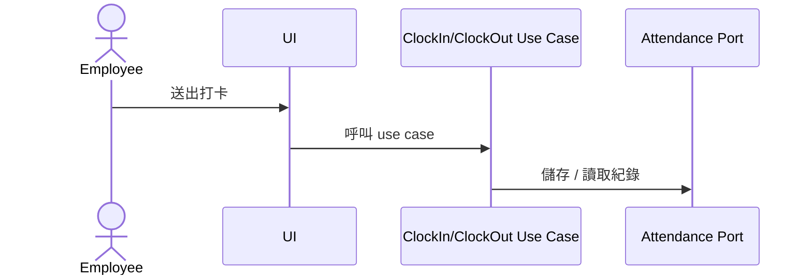
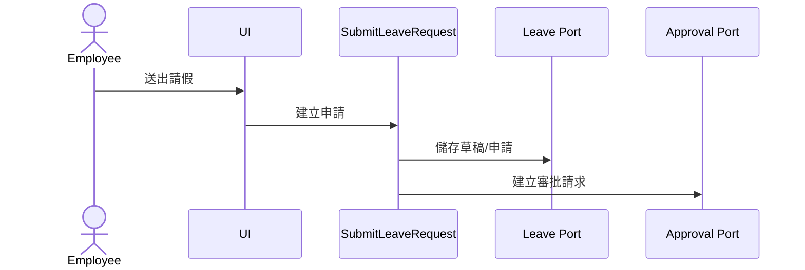
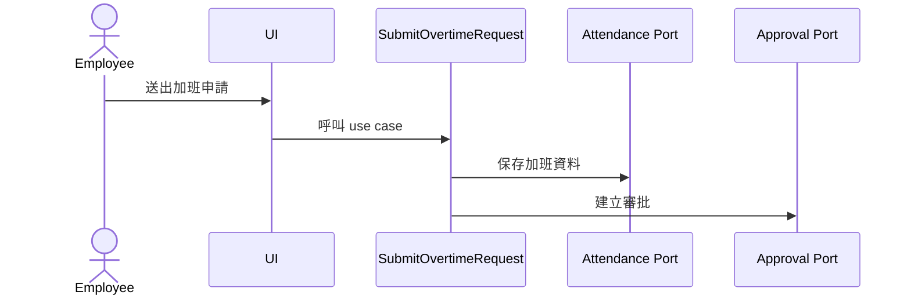
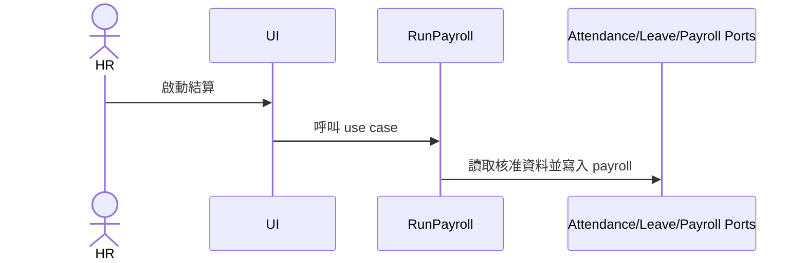

# Use Cases

## 目的
- 列出主要 use case 與流程邊界。

## 圖解
### 員工打卡

### 請假申請

### 加班申請

### 薪資結算

## 規則
- Use case 不含 Firebase SDK。
- 每個流程只暴露必要輸入與輸出。

## 範例
- `RunPayroll` 讀取 Attendance、Leave、Payroll ports。

## 維護注意事項
- 新流程先補本文件，再決定是否需要新 port。
