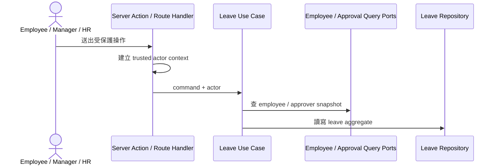
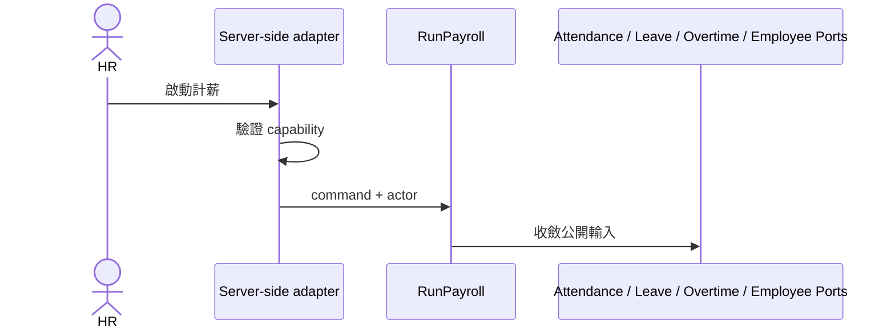

# Use Cases

## 目的
- 列出主要 use case、trusted actor 邊界與跨 Context 協作方式。

## 圖解
### Leave command flow

### Payroll flow

## 規則
- 每個 command 都由 server-side 建立 trusted actor context；client 只提供必要輸入。
- Use case 不含 Firebase SDK，不直接操作 document 或 UI state。
- Query 讀 read model / query port；command 走 aggregate 與 repository port。
- 跨 Context 只協調公開契約，不共享 aggregate 或 persistence model。

## 範例
| Use case | 主要 actor | 主要 ports |
| --- | --- | --- |
| `RecordPunch` | Employee | `AttendanceRecordRepository`, `EmployeeProfileQueryPort` |
| `SubmitLeaveRequest` | Employee | `LeaveRequestRepository`, `EmployeeProfileQueryPort`, `ApprovalQueryPort` |
| `ResolveApprover` | Manager / HR / System | `ApprovalAssignmentRepository` 或對應 query port |
| `RunPayroll` | HR | `PayrollRepository`, `AttendanceSummaryQueryPort`, `LeaveAdjustmentQueryPort`, `OvertimeAdjustmentQueryPort` |

## 維護注意事項
- 新流程先補本文件與 `ports.md`，再決定是否真的需要新的 adapter 或 collection。
