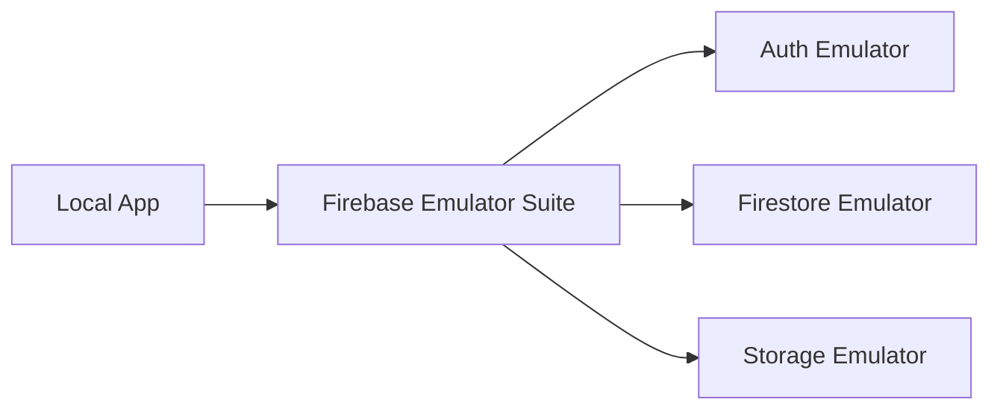

# Firebase Emulator

## 目的
- 提供本地開發與規則驗證方向。

## 圖解

```mermaid
flowchart LR
  DEV[Local App] --> EMU[Firebase Emulator Suite]
  EMU --> AUTH[Auth Emulator]
  EMU --> FS[Firestore Emulator]
  EMU --> ST[Storage Emulator]
```

## 規則
- 本地測試優先使用 Emulator。
- 規則調整後要先在 Emulator 驗證。

## 範例
- 開發請假流程時，先用 Emulator 驗證 approval 與 rules。

## 維護注意事項
- 連線方式與 port 變更時同步更新本文件。
