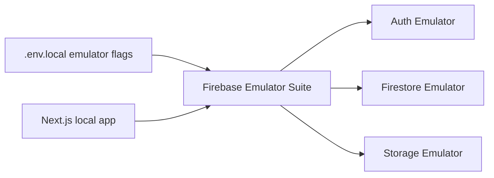

# Firebase Emulator

## 目的
- 定義本地 emulator 開發流程、seed / test data 建議與 rules 驗證 TODO。

## 本地流程

## 啟動步驟
| 步驟 | 指令 / 說明 |
| --- | --- |
| 安裝依賴 | `pnpm install` |
| 啟動前端 | `pnpm dev` |
| 啟動 emulator | `firebase emulators:start` |
| 只啟動指定服務 | `firebase emulators:start --only auth,firestore,storage` |

## Seed / test data 建議
- 使用獨立 tenant / fixture 前綴，避免與手動測試資料混用。
- fixture 至少覆蓋 `employee`、`manager`、`hr`、`payroll admin` 四種角色。
- 針對 `leave_requests`、`attendance_records`、`payroll_periods` 建立最小 happy path + denied path 資料組。

## Rules testing TODO
| 項目 | 建議 |
| --- | --- |
| Firestore rules | 補 self / team / admin matrix automated tests |
| Storage rules | 補本人附件與 payroll export denied cases |
| Audit flow | 驗證 denied / override 是否留下可追溯事件 |
