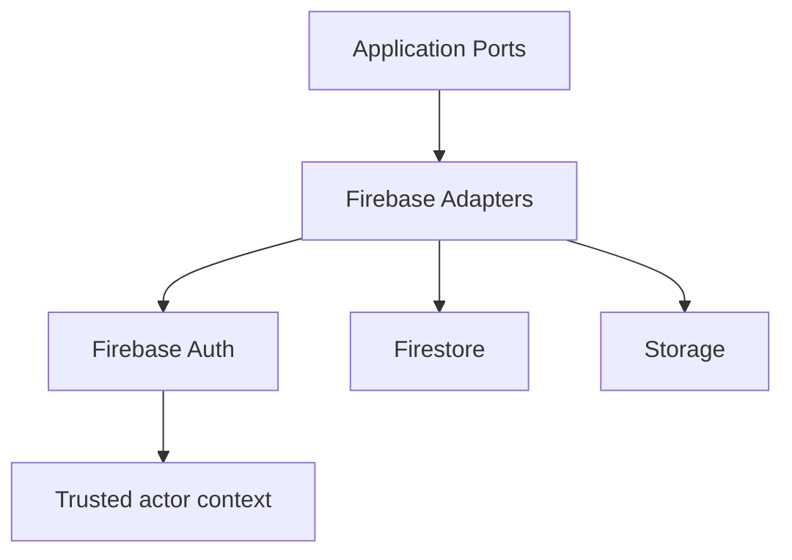

# Firebase Overview

## 目的
- 概覽 Firebase 在 worksync-hr 的責任、trusted actor 流程與 adapter 邊界。

## 圖解

## 規則
- Firebase SDK 僅存在於 adapter、rules 與必要的 server-side auth integration。
- Firebase Auth 只證明使用者身分；角色與 capability 真相不留在 Client Component。
- Firestore / Storage 進出都要經 mapper；document 不是 Domain entity。
- 敏感資料與 audit 寫入需經 server-side 流程與最小權限 rules。

## 範例
- Firestore repository adapter 可實作 `AttendanceRecordRepository`，但 Application 只看到 port。

## 維護注意事項
- 新增 Firebase 服務前先確認是否真的需要，並同步更新 schema、rules、security 文件。
