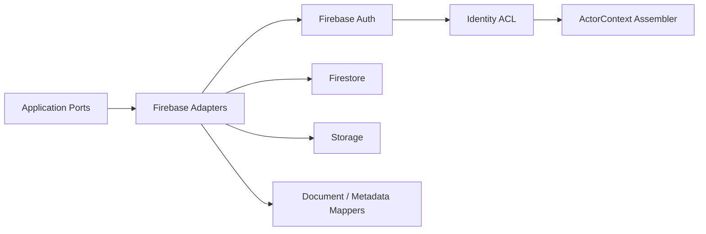

# Firebase 邊界

## 架構位置

## SDK 規則
| SDK／能力 | 允許位置 | 核心限制 |
| --- | --- | --- |
| Firebase Auth Web SDK | identity driving adapter | 只產生 token／session，不提供 Role、Capability、TenantId 真相 |
| Firebase Admin SDK | server-side Infrastructure | 會繞過 Security Rules，必須由 Use Case 驗證 tenant、capability、scope |
| Firestore SDK | repository／query adapter | document 必須經 mapper，不得進 Domain／Application contract |
| Storage SDK | file storage adapter | path、metadata 轉為 application reference |

## 多租戶規則
- 所有 Firestore／Storage path 使用可信任 `tenants/{tenantId}/...`，tenant 不從 Client payload 直接採用。
- Repository／Query adapter 必須比較 `ActorContext.tenantId`、path tenant 與 document tenant。
- 跨 tenant 查詢預設禁止；system job 必須逐 tenant 執行並建立 system ActorContext。

## Mapper
- `document -> mapper -> Aggregate / Read Model`。
- `Aggregate -> mapper -> write document`。
- Mapper 驗證 tenant path、schema version、Timestamp、null、敏感欄位與 optimistic version。
