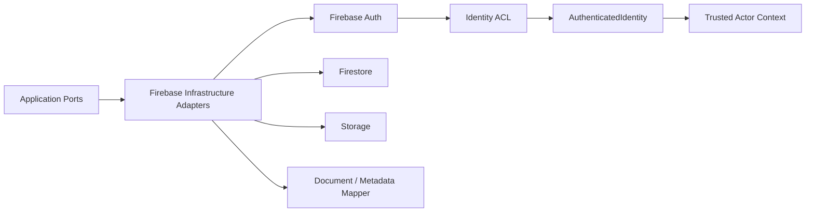

# Firebase Overview

## 目的
- 說明 Firebase 在本專案的邊界位置、SDK 限制與 mapper 規則。

## 邊界圖

## 邊界規則
| 主題 | 規則 |
| --- | --- |
| Firebase SDK | 只能出現在 `src/infrastructure/**` 或明確 server-side adapter |
| Auth | 只證明 identity，不證明 role / capability |
| Firestore | document 不是 Domain Entity，必須先經 mapper |
| Storage | path / metadata 不是 Domain object，必須轉成 application contract |
| Sensitive write | 薪資、權限、稽核、敏感個資一律 server-only |

## Mapper 規則
- `document -> mapper -> domain/read model`。
- `domain -> mapper -> write model/document`。
- mapper 需處理欄位命名、null / optional、時間型別、遮罩與版本欄位。
- Auth adapter 必須把 Firebase User / token claims 轉成 `AuthenticatedIdentity`；SDK 型別不得進入 Application 或 Domain。
