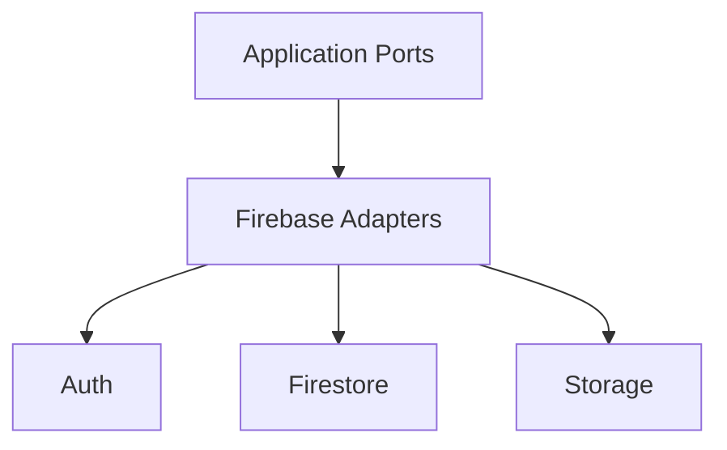

# Firebase Overview

## 目的
- 概覽 Firebase 在本專案的責任。

## 圖解

## 規則
- Firebase SDK 僅存在於 adapter 與 rules。
- 敏感資料更新需經 server-side 流程。

## 範例
- Firestore repository adapter 實作 `AttendanceRecordRepository`。

## 維護注意事項
- 新增 Firebase 服務前先確認是否真的需要。
