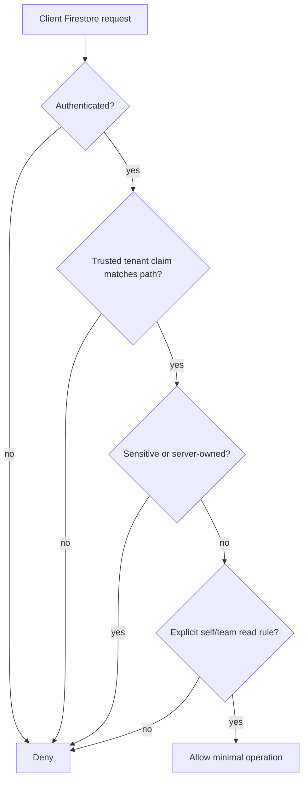

# Firestore Security Rules Blueprint

## 決策流程

## Rules 原則
- Default deny；只有明確 tenant path、operation、fields 與 scope 才允許。
- Client 不得寫 Membership、Role、Capability、敏感 Employee 欄位、attendance correction、LeaveBalance、Approval decision、Payroll、Audit 或受控 export metadata。
- Client claims 只做 Rules 的縱深防禦；server-side `ActorContext` 才是 Application 授權來源。
- Admin SDK 不受 Rules 限制，因此每個 server adapter 仍需驗證 tenant path 與 document tenant。
- Rules tests 必須涵蓋跨 tenant read/write、self/team、欄位提升權限、server-owned collection 與 Storage metadata。

## 可選 Client 存取
- 若需求允許，可開放本人非敏感 read model 讀取與最小附件上傳；業務 command 仍經 Server Action／Route Handler。
- 不因 Client 可讀 document 就把 document shape 當成 Published Language。
