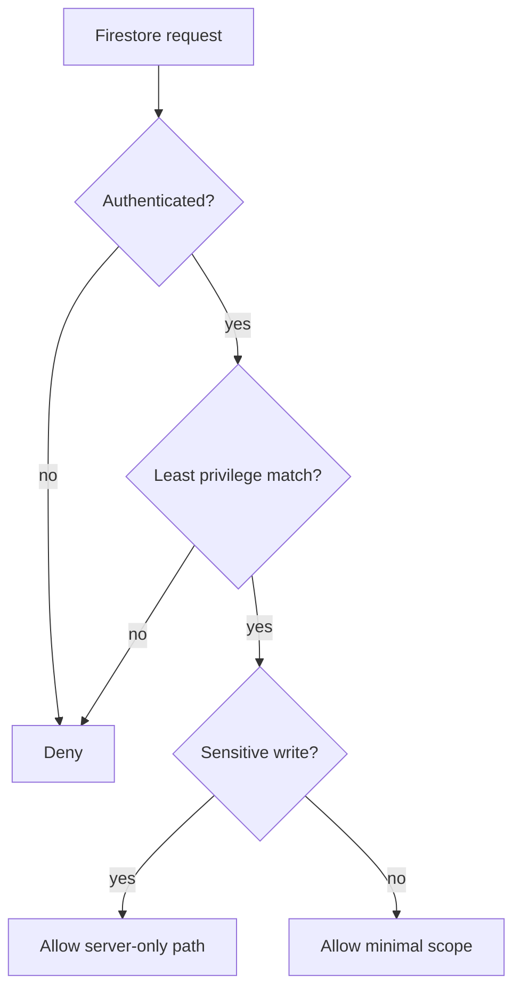

# Firestore Rules

## 目的
- 定義 Firestore Rules 的核心安全原則與待補測試項目。

## 原則圖

## Rules 原則
| 原則 | 說明 |
| --- | --- |
| Default deny | 沒有明確 allow 的請求一律拒絕 |
| Least privilege | 只開最小必要 path / action |
| Server-only sensitive writes | payroll、permissions、audit、sensitive HR write 不給 client |
| Scope aware | self / team / admin scope 分開判定 |
| Schema aligned | 欄位與 rules 一起演進 |

## 典型限制
- `salary_slips`：client 不可寫入；讀取需 Payroll Admin / HR server-side flow。
- `audit_logs`：只能追加，不能由 client 直寫或覆寫。
- `leave_requests.reason`：僅回傳給授權角色，不在公開列表裸露。

## Rules testing TODO
| 項目 | 狀態 |
| --- | --- |
| self vs team vs admin read matrix | TODO |
| payroll / audit server-only write cases | TODO |
| denied event audit correlation | TODO |
| schema drift detection checklist | TODO |
