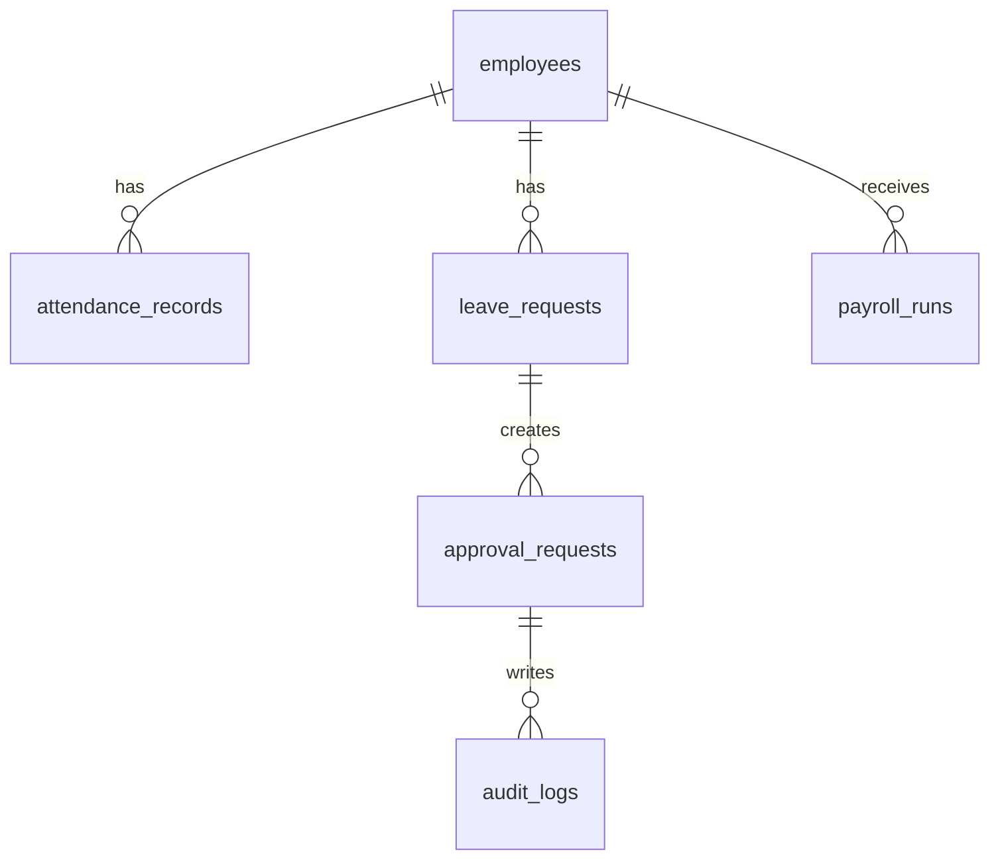

# Firestore Schema

## 目的
- 定義主要 collections 與關聯。

## 圖解

## 規則
- Collection 使用小寫複數與底線。
- Document 欄位先對齊 domain model，再由 mapper 轉換。

## 範例
- `attendance_records` 儲存 clock in/out 與狀態。

## 維護注意事項
- 新增 collection 時同步更新 rules 與權限文件。
