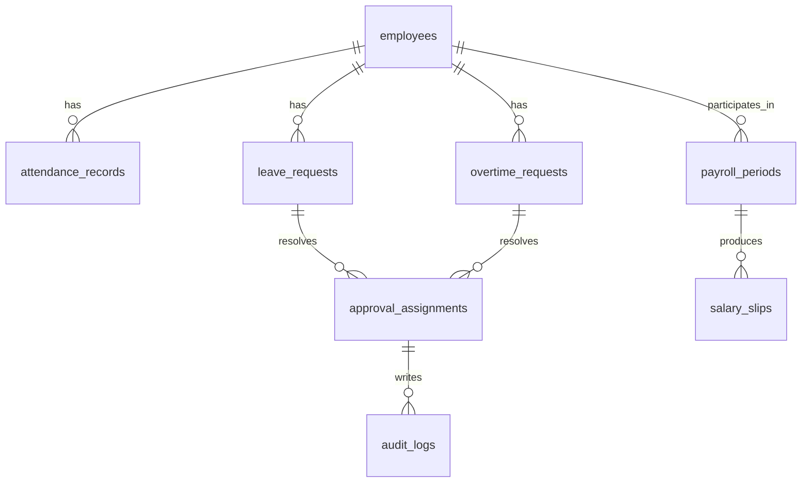

# Firestore Schema

## 目的
- 定義主要 collections、owner、主要欄位與敏感欄位，作為 mapper 與 rules 的共同依據。

## 圖解

## 規則
- Collection 名稱使用小寫複數與底線。
- Firestore document 欄位先對齊 use case / domain 語意，再由 mapper 轉成 entity 或 read model。
- 敏感欄位必須標示，並由 server-side 與 rules 一起保護。

## 範例
| Collection | Owner context | 主要欄位 | 敏感欄位 |
| --- | --- | --- | --- |
| `employees` | Employee | `employee_id`, `department_id`, `employment_status`, `manager_id` | `role_snapshot`, `capability_snapshot` |
| `attendance_records` | Attendance | `employee_id`, `work_date`, `punches`, `status` | `anomalies`, `correction_reason` |
| `leave_requests` | Leave | `employee_id`, `leave_type_id`, `period`, `status` | `reason`, `override_reason` |
| `overtime_requests` | Overtime | `employee_id`, `period`, `compensation_mode`, `status` | `reason`, `compensation_result` |
| `payroll_periods` | Payroll | `period`, `status`, `input_version` | `gross_total`, `net_total` |
| `salary_slips` | Payroll | `payroll_period_id`, `employee_id`, `published_at` | `gross_pay`, `net_pay`, `deductions` |
| `approval_assignments` | Approval | `resource_type`, `resource_id`, `approver_id`, `delegate_id`, `status` | `decision_reason` |
| `audit_logs` | Audit capability | `actor_id`, `action`, `target_id`, `occurred_at`, `result` | `reason`, `metadata` |

## 維護注意事項
- 新增 collection、欄位或索引前，先同步更新對應 domain / application 文件與 Firestore / Storage rules。
