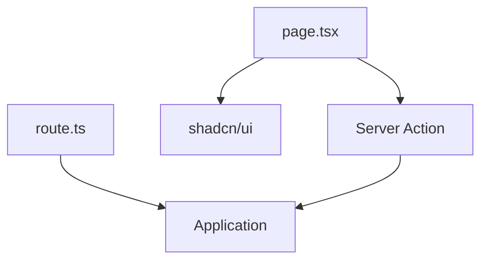

# App Router

## 目的
- 定義前端路由層責任。

## 圖解

```mermaid
flowchart TD
  Page[page.tsx] --> Action[Server Action]
  Page --> UI[shadcn/ui]
  Route[route.ts] --> APP[Application]
  Action --> APP
```

## 規則
- 頁面負責組裝畫面與觸發 use case。
- 寫入流程優先走 Server Actions / Route Handlers。

## 範例
- 請假表單頁面送出後呼叫 server-side use case。

## 維護注意事項
- 新頁面先標示 server/client 邊界。
