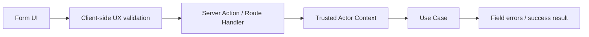

# Forms

## 目的
- 定義表單驗證、Server Action 邊界與敏感資料寫入規則。

## 表單流程

## 驗證規則
| 層級 | 責任 |
| --- | --- |
| Client | 必填、格式、互動提示 |
| Server Action / Route Handler | schema 驗證、actor context、錯誤轉譯 |
| Use Case / Domain | 真正業務規則與狀態轉移 |

## 邊界規則
- 表單 input 只帶 minimal fields，不帶 role / capability truth。
- 敏感表單（薪資、權限、audit、個資 override）只能送到 server-side adapter。
- Client Component 不可直接寫 Firestore / Storage sensitive path。
- 表單 state 管理可以在 client，但結果決策在 server-side。
