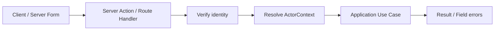

# Forms 與 Server Mutation

## 責任
| 層級 | 責任 |
| --- | --- |
| Client | UX 格式提示、互動狀態；資料不可信任 |
| Server Action／Route Handler | schema validation、identity、tenant、capability、scope、error mapping |
| Use Case／Domain | 業務不變條件、狀態轉移、Port orchestration |

## 規則
- Server Actions 與 Route Handlers 都是公開端點，不因來源是 Server Component 就略過授權。
- Form 不送可信任 tenant、Role、Capability 或 approval responsibility。
- 敏感 Employee、Membership、Attendance correction、LeaveBalance、Approval、Payroll、Audit、export 只能走 server-side Use Case。
