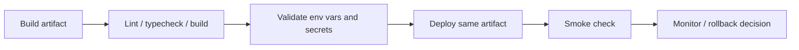

# Deployment

## 目的
- 記錄部署方向、環境邊界與 rollback 基本要求。

## 圖解

## 規則
- deployment 不得繞過 Application / Domain 邊界或 server-side 敏感寫入流程。
- staging、production 應使用獨立 secrets、Firebase 設定與權限邊界。
- rollback 需回答 artifact、rules、schema / document 相容性與敏感資料風險。
- health、smoke 與 audit 要能區分部署失敗與業務規則失敗。

## 範例
- 若未來使用 Firebase App Hosting，仍需保留 Route Handler / Server Action 對敏感資料的 server-side 控制。

## 維護注意事項
- 實際部署流程確定後，再補更細的 runbook、health endpoint 與恢復流程。
