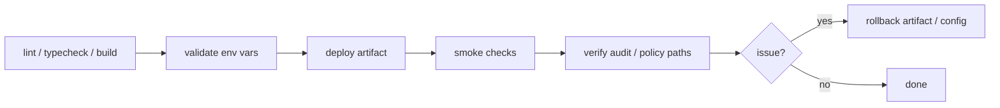

# Deployment

## 目的
- 比較部署策略並定義基本 rollout / rollback 檢查點。

## 策略比較
| 平台 | 優點 | 注意事項 |
| --- | --- | --- |
| Vercel | Next.js 整合成熟、preview 方便 | 仍需妥善保護 server-only env 與 Firebase admin 邊界 |
| Firebase Hosting / App Hosting | Firebase 生態整合佳、同平台治理方便 | 需確認 Next.js App Router 支援細節與 server runtime 邊界 |

## 共通部署流程

## 決策原則
- 敏感寫入仍必須經 server-side use case，不因平台改變。
- staging / production 使用獨立 secrets、Firebase project、rules 生命週期。
- schema / rules / app deploy 順序需可回滾。
