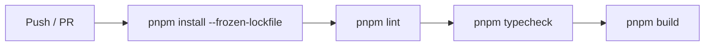

# GitHub Actions

## 目的
- 說明目前 CI 的最小 quality gate 與已知限制。

## 圖解

## 規則
- CI 使用 Node.js 22 與 pnpm 11。
- workflow 以 concurrency 避免同一 branch 的重複執行堆積。
- 只有 repo 內已存在的 gate 才能列為必過條件；新增 gate 前先補對應 script 與文件。
- build 失敗時先區分程式錯誤、腳本缺失與外部依賴問題。

## 範例
- 目前 `pnpm build` 可能因 `src/app/layout.tsx` 使用 `next/font/google` 抓取 Geist 字型，在受限網路環境失敗；這是已知環境限制，不能誤報為 lint / typecheck 問題。

## 維護注意事項
- 調整 workflow 指令、Node 版本或 cache 策略時，同步更新 `local-setup.md` 與 PR template 的驗證清單。
