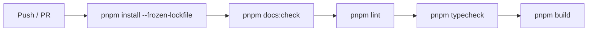

# GitHub Actions

## 目的
- 記錄 CI 最小 gate、版本對齊與 build 失敗排查方向。

## CI 流程

## CI 規格
| 項目 | 設定 |
| --- | --- |
| Node.js | 24.18.0 |
| pnpm | 11.9.0 |
| quality gates | `pnpm docs:check` → `pnpm lint` → `pnpm typecheck` → `pnpm build` |
| concurrency | 同 branch workflow 互斥執行 |

## build 失敗排查
| 症狀 | 先檢查 |
| --- | --- |
| `next/font/google` 失敗 | 受限網路是否擋住 Geist 字型下載 |
| env 缺失 | `.env.local` / secrets 是否缺值或命名錯誤 |
| Firebase config 問題 | public config 與 admin config 是否混用 |
| type error | `pnpm typecheck` 是否先失敗 |
| lint error | `pnpm lint` 是否先失敗 |

## 注意事項
- CI 與本地版本應對齊 Node.js 24.18.0 / pnpm 11.9.0。
- 若本地環境啟用額外 supply-chain 防護，可能比 CI 多出 install 限制，需先處理本地 build scripts 批准問題。
