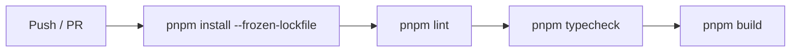

# GitHub Actions

## 目的
- 說明 CI 的最小驗證範圍。

## 圖解

## 規則
- CI 使用 Node.js 22 與 pnpm。
- 失敗時先區分腳本缺失、型別錯誤、建置錯誤。

## 範例
- 目前 workflow 已保留 `pnpm typecheck`，需後續補上對應 script。

## 維護注意事項
- 若 build 依賴外部資源，需再評估 CI 穩定性。
