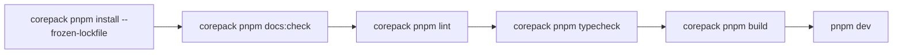

# Local Setup

## 目的
- 對齊本地開發、Windows 11 安裝與 CI 版本。

## 版本對齊
| 項目 | 版本 |
| --- | --- |
| Node.js | 24.18.0 LTS |
| pnpm | 11.9.0 |
| 驗證指令 | `corepack pnpm quality:check` |

## Windows 11 + pnpm 流程
| 步驟 | 說明 |
| --- | --- |
| 安裝 Node.js 24.18.0 | 使用 `.node-version` 對齊 CI；可使用版本管理器或官方安裝程式 |
| 啟用 Corepack | `corepack enable` |
| 安裝 pnpm 11.9.0 | `corepack install --global pnpm@11.9.0` |
| 確認版本 | `node --version` 應為 `v24.18.0`；`corepack pnpm --version` 應為 `11.9.0` |
| 安裝依賴 | `corepack pnpm install --frozen-lockfile` |
| 啟動開發 | `corepack pnpm dev` |

## 最小驗證流程

## Firebase Emulator
- 全功能：`firebase emulators:start`
- 指定服務：`firebase emulators:start --only auth,firestore,storage`

## 已知限制
- 目前 `pnpm build` 在受限網路環境可能因 `next/font/google` 抓取 Geist 字型失敗。
- 不直接依賴 PATH 中的其他 pnpm；使用 Corepack 依 `packageManager` 固定為 11.9.0。
- pnpm v11 的 dependency build scripts 只允許 `pnpm-workspace.yaml` 中明確列為 `true` 的套件。
