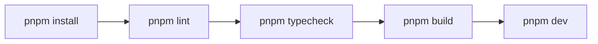

# Local Setup

## 目的
- 對齊本地開發、Windows 11 安裝與 CI 版本。

## 版本對齊
| 項目 | 版本 |
| --- | --- |
| Node.js | 22.x |
| pnpm | 11.9.0 |
| 驗證指令 | `pnpm lint`、`pnpm typecheck`、`pnpm build` |

## Windows 11 + pnpm 流程
| 步驟 | 說明 |
| --- | --- |
| 安裝 Node.js 22 | 建議使用 nvm-windows 或官方安裝程式 |
| 啟用 Corepack | `corepack enable` |
| 安裝 pnpm 11.9.0 | `corepack prepare pnpm@11.9.0 --activate` |
| 安裝依賴 | `pnpm install` |
| 啟動開發 | `pnpm dev` |

## 最小驗證流程

## Firebase Emulator
- 全功能：`firebase emulators:start`
- 指定服務：`firebase emulators:start --only auth,firestore,storage`

## 已知限制
- 目前 `pnpm build` 在受限網路環境可能因 `next/font/google` 抓取 Geist 字型失敗。
- 若本地 shell 啟用 supply-chain / ignored builds 防護，`pnpm install` 可能先要求批准 build scripts。
