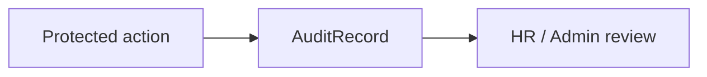

# Audit

## 目的
- 確保重要操作、override 與敏感資料存取都可追溯。

## 圖解

## 規則
- 稽核紀錄至少包含 `actorId`、`action`、`targetType`、`targetId`、`occurredAt`、`result`、必要時的 `reason`。
- 稽核事件只能 server-side 建立；Client Component 不可直接寫入、覆寫或刪除。
- 記錄敏感事件時要最小揭露，不在 log / audit 中保存 secret、token、完整附件內容或不必要的全文理由。

## 範例
- 請假 override、薪資結算、權限變更、敏感資料檢視與 rules 相關拒絕事件都應留下稽核紀錄。

## 維護注意事項
- 欄位、保存期限或遮罩策略調整時，同步更新 data classification 與 infrastructure 文件。
