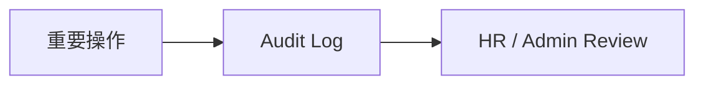

# Audit

## 目的
- 確保重要操作可追溯。

## 圖解

```mermaid
flowchart LR
  Action[重要操作] --> Log[Audit Log]
  Log --> Review[HR / Admin Review]
```

## 規則
- 記錄 actor、action、target、timestamp。
- 稽核資料寫入與更動皆需 server-side 控制。

## 範例
- 薪資結算完成後寫入批次 audit event。

## 維護注意事項
- 稽核欄位若調整，需同步更新 domain 與 schema 文件。
