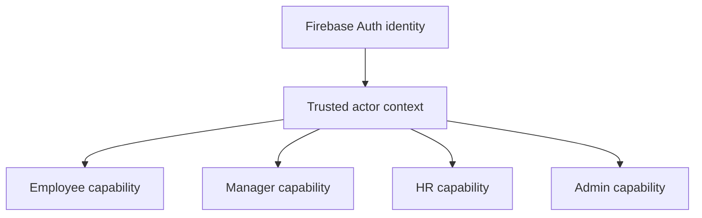

# Roles & Permissions

## 目的
- 定義主要角色、capability 與 trusted actor 邊界。

## 圖解

## 規則
- Auth provider 只證明 identity；角色、membership、scope、capability 由 server-side actor context 提供。
- 最小權限優先；沒有明確 capability 的 command 不得放行。
- Employee 不可自我核准；Manager 只可作用在授權範圍；HR / Admin 的 override 必須可追溯。
- Payroll、permissions、audit log、敏感資料寫入不得由 Client Component 直接發生。

## 範例
| Capability | Employee | Manager | HR | Admin |
| --- | ---: | ---: | ---: | ---: |
| `attendance.record.self` | ✓ | ✓ | ✓ | ✓ |
| `leave.submit.self` | ✓ | ✓ | ✓ | ✓ |
| `leave.read.team` |  | ✓ | ✓ | ✓ |
| `leave.approve.team` |  | ✓ | ✓ | ✓ |
| `leave.override` |  |  | ✓ | ✓ |
| `payroll.run` |  |  | ✓ | ✓ |
| `audit.read` |  |  | ✓ | ✓ |
| `permissions.manage` |  |  |  | ✓ |

## 維護注意事項
- 角色矩陣變更時同步更新 rules、Firestore schema、PR template 與相關 use case 文件。
