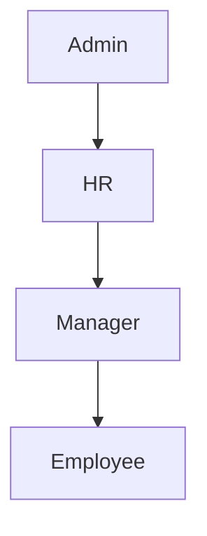

# Roles & Permissions

## 目的
- 定義主要角色的高層級權限邊界。

## 圖解

| 角色 | 可管理範圍 | 敏感寫入 |
| --- | --- | --- |
| Admin | 系統、角色、稽核 | 可，需 server-side |
| HR | 員工、薪資、報表 | 可，需 server-side |
| Manager | 團隊審批、查看團隊資料 | 部分，需 server-side |
| Employee | 個人資料、打卡、請假 | 僅非敏感個人資料 |

## 規則
- Payroll、permissions、audit log 不得由 Client Component 直接寫入。
- 最小權限優先，角色升級需留下稽核。

## 範例
- Employee 可送出請假申請，但不可直接核准自己的申請。

## 維護注意事項
- 角色矩陣變更時同步更新 rules 與 page map。
