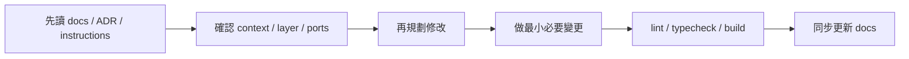

# Copilot Usage

## 目的
- 定義 GitHub Copilot Agent 在 worksync-hr 的工作流程與禁止事項。

## 修改前必讀
| 順序 | 文件 |
| --- | --- |
| 1 | `README.md` |
| 2 | `docs/README.md` |
| 3 | `docs/01-architecture/*` 與 `docs/01-architecture/adr/README.md` |
| 4 | 相關 `docs/02-domain/*`、`docs/03-application/*` |
| 5 | 涉及 Firebase / Frontend / Security 時，讀對應 `docs/04-08/*` |
| 6 | `.github/copilot-instructions.md` 與 `.github/instructions/*` |

## Agent 工作流程

## 禁止事項
- 不可直接繞過 Domain。
- 不可把 Firebase 型別放進 Domain。
- 不可把薪資、權限、稽核寫入放在 Client Component。
- 不可把 slot / page / route group 當成 bounded context 真相。
