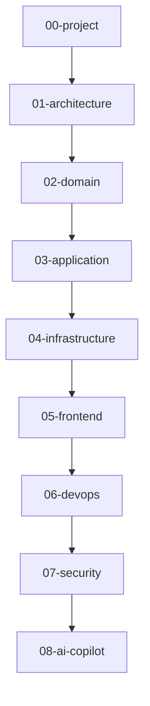

# docs

## 目的
- 提供 worksync-hr 的最小可維護文件索引。

## 圖解

## 規則
- 先更新對應章節，再補 ADR。
- 每份文件維持短條列與 Mermaid 優先。

## 範例
- 新增 Firestore collection 時，同步更新 `04-infrastructure/firestore-schema.md`。

## 維護注意事項
- 避免把此目錄寫成完整教科書。
