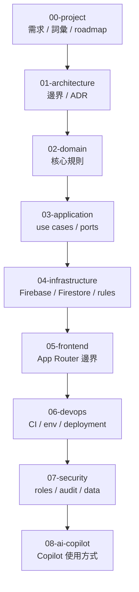

# docs

## 目的
- 提供 worksync-hr 的輕量 canonical docs 入口。
- 讓需求、架構、Domain、Infrastructure、Security 與 DevOps 都有單一真相來源。

## 圖解

## 閱讀順序
- 變更需求或詞彙：先看 `00-project/requirements.md`、`00-project/glossary.md`。
- 變更邊界、命名、依賴：先看 `01-architecture/`。
- 變更 business rule：再看 `02-domain/` 與 `03-application/`。
- 變更 Firebase、schema、rules：看 `04-infrastructure/` 與 `07-security/`。
- 變更 workflow、環境、部署：看 `06-devops/`。

## 規則
- `docs/` 是規範來源；範例、issue、PR 描述不可覆蓋此處規則。
- 語言、邊界、路由、角色、schema、rules、Mermaid 有變更時，先更新擁有該規則的文件。
- Mermaid 與規則放在同一份 canonical doc，不建立第二份圖表真相來源。
- 文件維持短條列、表格與圖優先；避免把此目錄寫成教科書。

## 範例
- 新增 `overtime_requests` collection 時，同步更新 `04-infrastructure/firestore-schema.md`、`07-security/roles-permissions.md` 與對應 domain / use case 文件。

## 維護注意事項
- 重大且難逆轉的跨 Context 決策再補 `01-architecture/adr/`。
- 若只是流程補充或規則澄清，優先更新既有 canonical docs。
